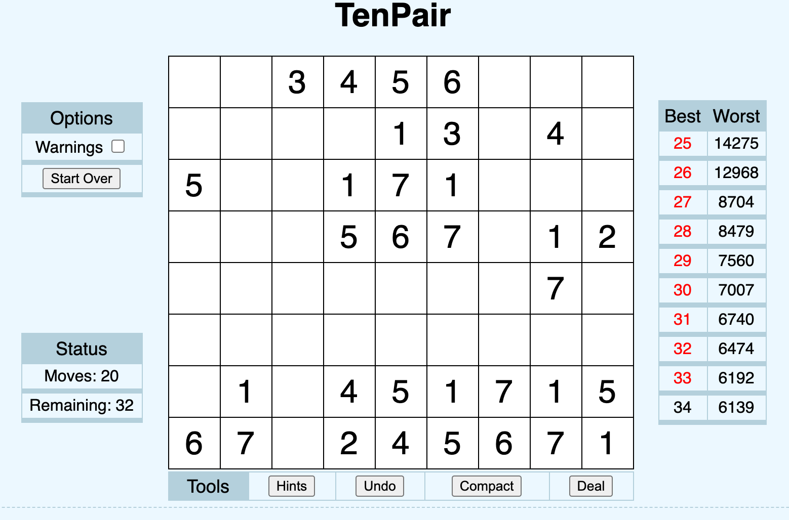

# TenPair (Numberama) solver
This script plays TenPair (Numberama) game for you.
It doesn't solve it - it plays it. That means it doesn't look for an optimal solution. Just strikes out anything valid.

## How to use

- Open the link https://www.logicgamesonline.com/tenpair/ 
- Paste "ten_pair.js" code in the console of the browser
- Put "strikeAll();deal();" in the console for each iterration.

## How does it look like

